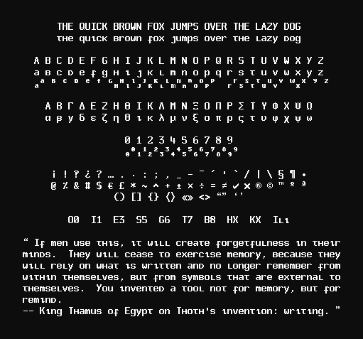
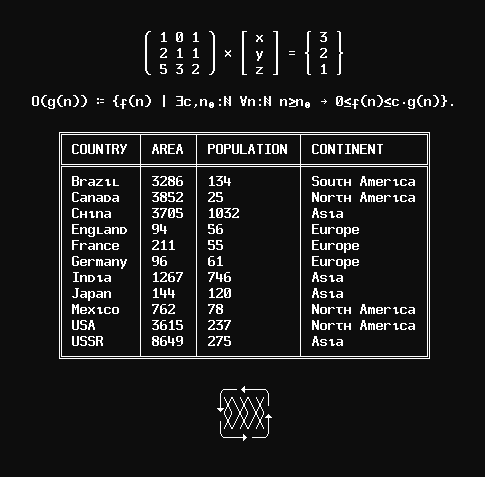
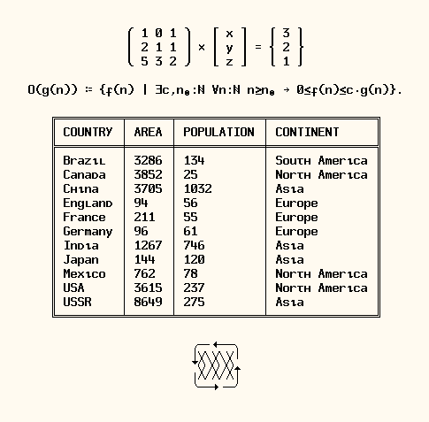

#                                TADEPE

Tadepe is a 8x16 bitmap font of questionable aesthetics for X11.

Tadepe has the following X11 Logical Font Description (XLFD):

	-misc-tadepe-bold-r-normal--16-150-75-75-C-80-ISO10646-1

Tadepe was originally Spleen (used on OpenBSD) and shares the same
license. However, Tadepe has diverged and it is now very different
from Spleen.

Tadepe is very incomplete and lacks support for lots of glyphs.
Glyphs are added by necessity.

Tadepe does not support Turkish and its two i-s.

Lowercase Latin letters do not have ascenders (lower B, T and K
resemble cyrillic minuscules, for example).  Lowercase J and I
do not have tittle (they are undotted).

TODO:
• Fix diacritics on uppercase letters
• Fix drawing characters
• Create 12x24 and 16x32 variants.
• Create non-monospace variants (use Apple's Chicago as reference?).
• Create slanted/italic variants.
• (Re)write normal (non-bold) style (not maintained anymore).
• Draw more glyphs.
• Lower cap height from 10px to 9px? (I experimented and liked it)
• Write script to generate specimen/demo image.
• Write script to generate pre-composed accented letters from base
  letters and combining diacritics.
